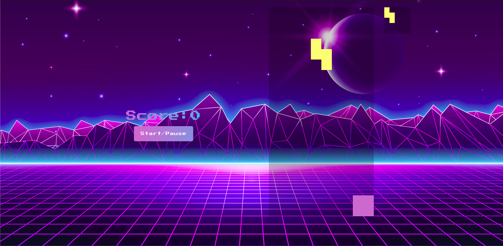

# Tetris - https://uditi1.github.io/Tetris-Game/

A simple HTML and javascript tetris game. It is 10 row width and 20 column height tetris game.

# Why I create it?
To learn javascript and become more compatible with it.

# Technologies Used

* HTML5
* CSS
* javascript
  
# Features

* Support inputs from keyboard.
* Play and Pause functions
* Next piece is randomly chosen

# Game Controls

Players can use keyboards mentioned keys to interact with pieces

|  Actions        |   Keys      |
|:----------------|------------:|
| Move piece left |    ←        |
| Move pice right |    →        |
| Rotate piece    |    ↑        |
| Move down piece |    ↓        |

# Dimensions

|  Parameter      |      Description                 |   Value      |
|:----------------|:--------------------------------:|-------------:|
|  Board Width    |Width of board on base of square  |     10       |
|  Board Height   |Height of board on base of square |     20       |
|  Square Size    |Size of square                    |     40       |
